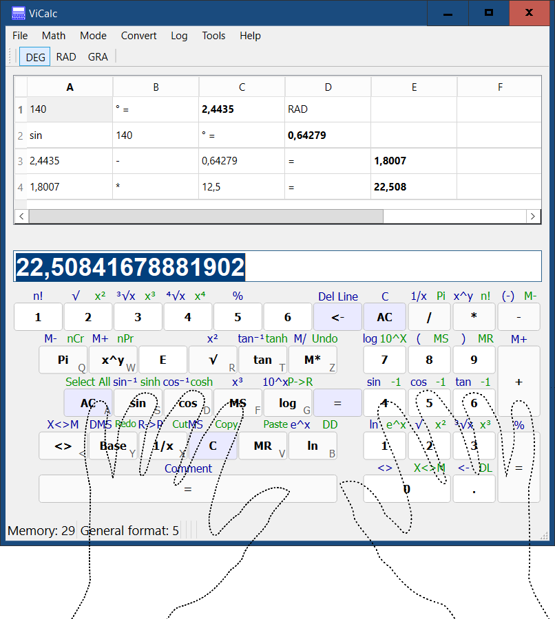
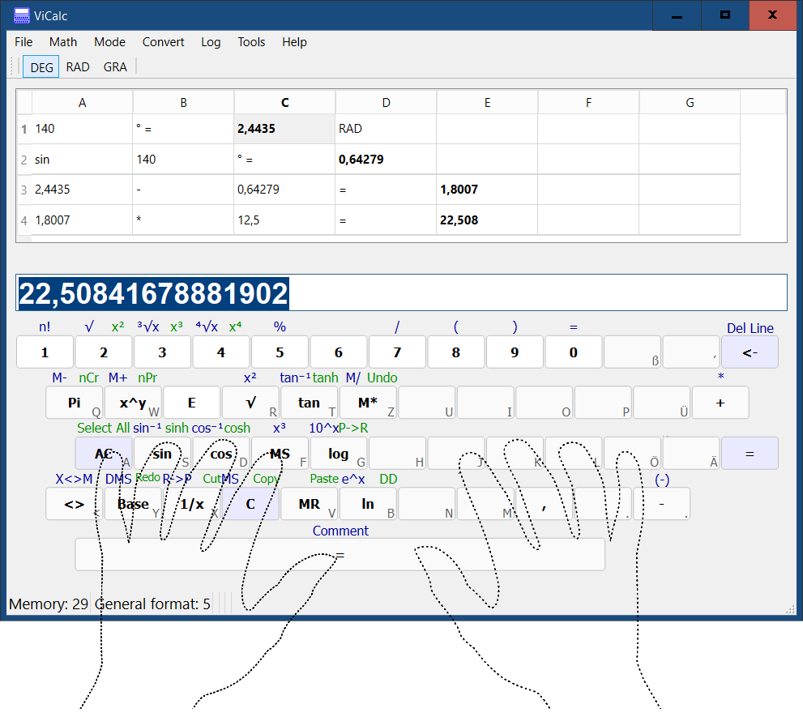
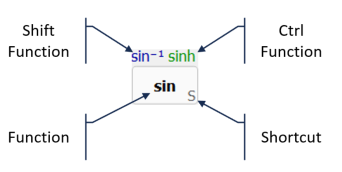
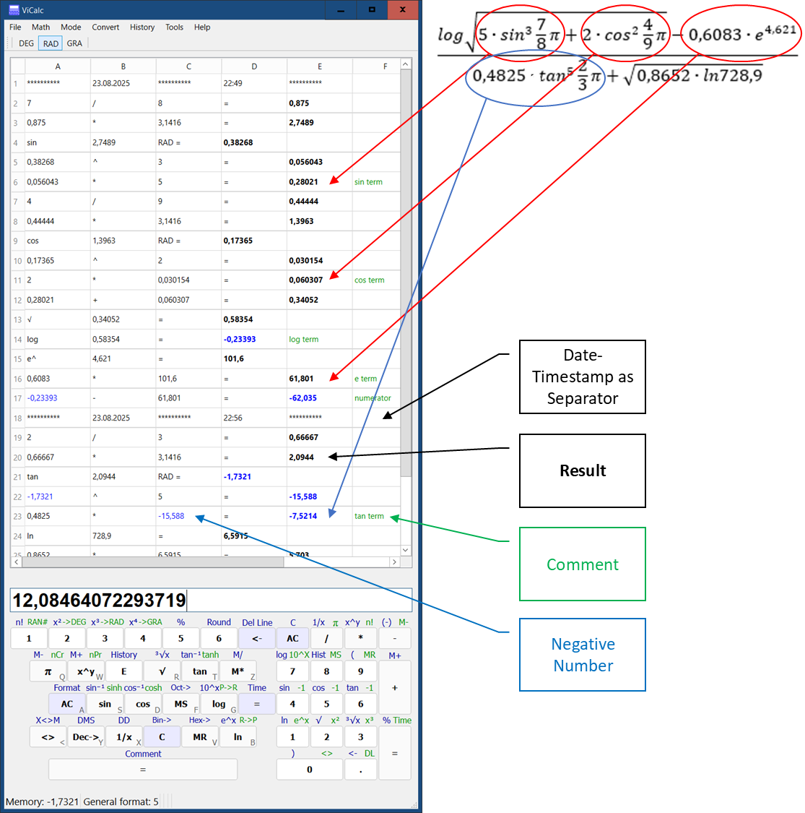

# ViCalc

ViCalc is an open-source touch-typing calculator with calculation history (Python). It combines the simplicity of a traditional calculator with the power of a PC, allowing users to perform calculations without leaving the keyboard.





## Calculation Example


## Key Features

- Touch-Typing Optimized: Keys are split for left-hand (left keyboard side) and right-hand (right side or numeric keypad) operation, enabling fast ten-finger typing.
- Calculation History: Automatically records output, allowing you to review or reuse past calculations.
- Mouse Support: Use the mouse for a traditional calculator experience.
- Cross-Platform: Runs on any system with Python.
- Open Source: Contributions are welcome to add new features!

## History

Originating in 2003, ViCalc was rewritten in Python to modernize it. It was created to address the need for a tool that integrates coding and calculations, supporting ten-finger typing for academic and professional tasks like mathematical modeling.

## Installation

You can install and run **ViCalc** using one of the following methods:

### Option 1: Use the Installer (Windows)

1. Go to the [Releases](https://github.com/Kudaschov/ViCalc/releases) page.
2. Download **`ViCalcSetup.exe`** from the **Assets** section of the latest release.
3. Run the installer and follow the on-screen instructions.

### Option 2: Clone and Run from Source

1. Clone the repository:
   ```bash
   git clone https://github.com/kudaschov/ViCalc.git
   cd ViCalc

2. Run ViCalc
   ```bash
   python -m vicalc

## License
Copyright (c) Dr. Vitali Kudaschov, 2003 - 2025.

Licensed under the [MIT License](./LICENSE).
