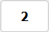
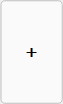
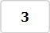
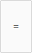
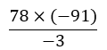
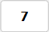
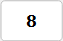
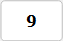
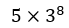

# Basic Operations
Keyboard and mouse input are supported.
You can enter decimal numbers using either a dot (.) or a comma (,).
In the input box, the decimal separator is always displayed as a dot (.). 

To perform the operation, type the equals (=) or press Enter.

## Example 1
12 + 3.4 - 56 

 
Result: __-40.6__ 

## Example 2
 

 
Result: __2366__ 

To enter a negative sign, type the underscore (_) or use the shortcut Shift + Numpad Minus (–) (Num Lock must be enabled).
The regular minus key is used for subtraction.

## Example 3
 

 
Result: __1500000000__ 

Type letter e to enter exponential notation (for example, 3e8 = 300000000).