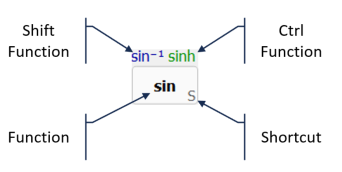

# ViCalc Help

[Using ViCalc](using.md) 
[Number Input Format](number_format.md) 
[Calculation History](history.md) 

## Operations
[Percent Calculations](percents.md) 

## Keys and their functions
 
[General keys](keys_general.md) 