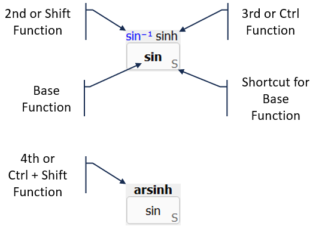

# ViCalc Help
## Key usage
 

## Key Mapping Overview

* **Base Function:** Standard key.
* **2nd Function:** Accessible via **Shift**.
* **3rd Function:** Accessible via **Ctrl**.
* **4th Function:** Accessible via **Ctrl + Shift**.

## How to Switch Functions

### 1. Keyboard Shortcuts
Press and hold modifier keys to switch mode while typing: 
* **2nd Function:** Press and hold <kbd>Shift</kbd>. 
* **3rd Function:** Press and hold <kbd>Ctrl</kbd>. 
* **4th Function:** Press and hold <kbd>Ctrl</kbd> + <kbd>Shift</kbd>.

### 2. Sticky / Latch Mode (Lock Mode)
If you prefer traditional physical calculator behavior—where alternate functions remain active after key release—use one of the following methods: 
* **2nd Function:** Press <kbd>Page Down</kbd>. Useful when working with the NumPad 
* **3rd Function:** Press <kbd>Page Up</kbd>. Useful when working with the NumPad 
* **4th Function:** Press twice <kbd>Page Down</kbd>. Useful when working with the NumPad 
* **On-Screen Buttons:** Click the **2nd**, **3rd**, or **4th** mode buttons on the interface. 
* **Double-Tap Shortcut:** Double-press <kbd>Shift</kbd>, <kbd>Ctrl</kbd>, or <kbd>Ctrl</kbd> + <kbd>Shift</kbd> on your keyboard to lock that function layer.

## Overview
[ViCalc](overview.md) 
[Number Input Format](number_format.md) 
[Calculation History](history.md) 
[Calculation Example](calc_example.md) 
## Functions and Operations
[Basic Operations](basic_operations.md) 
[Reciprocal](reciprocal.md) 
[Trigonometric and Inverse Trigonometric Functions](trigonometry.md) 
[Percent Calculations](percents.md) 
## Keys and their functions
[General](keys_general.md) 
[Special](special.md) 
[Memory](memory.md) 
[Scientific](scientific.md) 