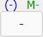

# Number Input Format

**Format:**  
-1.23456789e-123

## Keyboard Usage

| Function | Main Keyboard Section | Numeric Keypad | Comment |
|---|---|---|---|
| Numeric digits `0` – `9` | Keys `0` – `9` | Keys `0` – `9`||
| Decimal separator `.` | `.` or `,`| `.` or `,`||
| Negative sign | `_` (underscore) | Shift + | Regular Minus performs subtraction |
| Exponent | `e` or `E` || For example, 2e3 = 2000 |