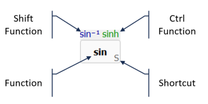
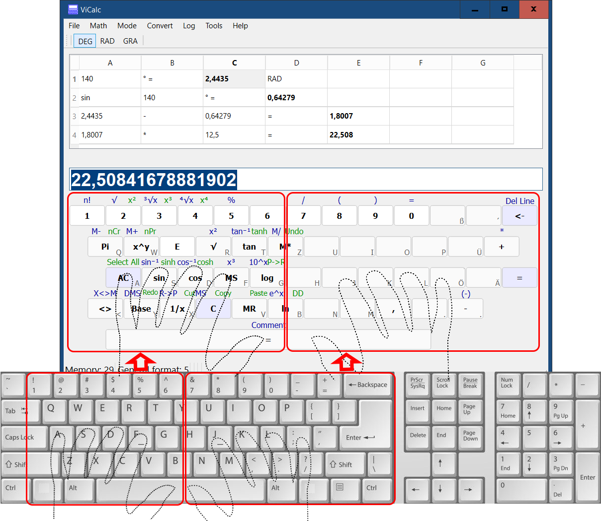

# ViCalc Overview

ViCalc is a touch-typing scientific calculator with a key-preselection function. It turns your PC keyboard into a scientific calculator, while full mouse support is also available.

The upper part of the ViCalc window displays the calculation history.
The lower part shows the left section of the main keyboard area and the numeric keypad.

## Keyboard Operation Modes

ViCalc supports two keyboard operation modes.

### Mode 1
In this mode, the left hand remains in the standard touch-typing position (ASDF), while the right hand operates the numeric keypad (see picture above).

The numeric keypad functions as a scientific calculator.
The left hand is used for additional input functions:

- E key – enter the exponent (scientific notation)
- Shift – access the second function of a key (see picture below)
- Ctrl – access the third function of a key (see picture below)
- Additional scientific functions (for example polar coordinates) that are not available directly on the numeric keypad

 

### Mode 2

If the user prefers the traditional touch-typing position (ASDF and JKL:), or if a full-size keyboard with a numeric keypad is not available (for example on notebooks), ViCalc provides Operation Mode 2.

In this mode, the right side of the main keyboard area is used instead of the numeric keypad (see picture below).

Although this section of the keyboard is not displayed on the screen, it is fully supported. It is used for entering the symbols exactly as they appear on the keyboard, including:

- Numbers 7, 8, 9, 0
- Parentheses ()
- \+ − * /
- ., =
- underscore for negative sign
- Backspace
- Enter
- Shift
- Control 

 

## Key-Preselection Function
The Key-Preselection feature allows you to preview a key before its function is executed.

This function requires a keyboard with analog input. ViCalc was developed and tested using the Wooting Two HE keyboard. With a standard keyboard, ViCalc works fully, but the Key-Preselection feature is not available.

When a key is lightly pressed, the corresponding function is highlighted (preselected) on the screen.
If this is the desired function, you can press the key fully to execute it.

If the highlighted function is not the intended one, you can simply release the key and correct your input without triggering the wrong function.
 