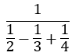
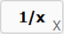

# Reciprocal

## Keyboard Usage

| Function | Keyboard Shortcut |
|---|---|
| Reciprocal `1/x` | `x` |

### Alternative Numeric Keypad
| Function | Keyboard Shortcut |
|---|---|
| Reciprocal `1/x` | `Shift + Numpad 1` |

## Example
 

 
 
 
 
Result: __2.4__ 