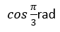
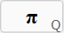
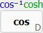

# Trigonometric and Inverse Trigonometric Functions

## Angle Unit Selection

Choose the angle unit used for calculations.

**Menu**  
`Mode → DEG`  
`Mode → RAD`  
`Mode → GRA`

**Toolbar**  
`DEG`, `RAD`, `GRA`

**Hotkeys**  
- `F2` — DEG  
- `F3` — RAD  
- `F4` — GRA  

**Options**  
Automatic angle unit conversion when switching units can be enabled or disabled in: `Tools → Options`

## Keyboard Usage

| Function | Keyboard Shortcut |
|---|---|
| π (Pi) | `q` |
| Cosine `cos()` | `d` |
| Arccosine `acos()` | `Shift + d` |

### Alternative Numeric Keypad Shortcuts

| Function | Numpad Shortcut |
|---|---|
| π (Pi) | `Ctrl + Numpad *` |
| Cosine `cos()` | `Shift + Numpad 5` |
| Arccosine `acos()` | `Ctrl + Numpad 5` |

## Example 1
 
Press F3 to switch to radians. 

 
 

Result: __0.5__ 
## Example 2
Calculate the arccosine of 0.5 in degrees.  
Press F2 to switch to degrees. 
 
Shift +   
Result: __60__